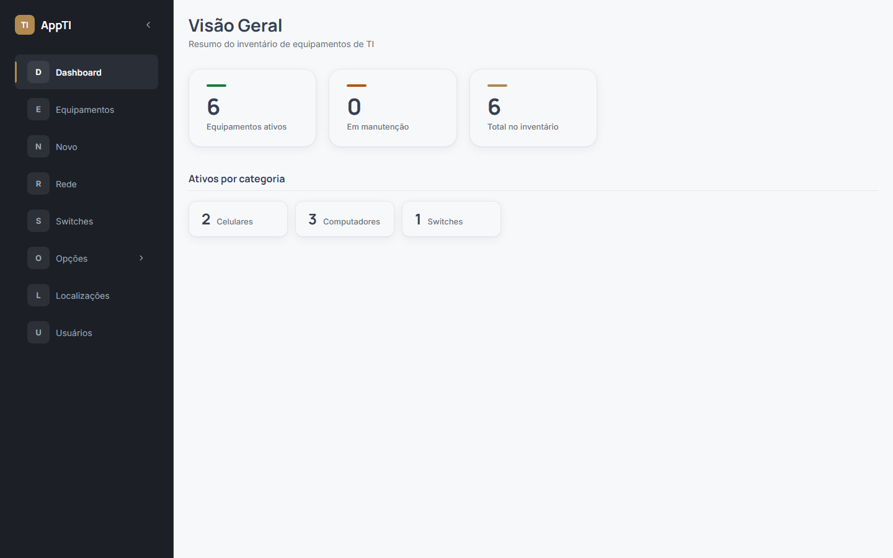
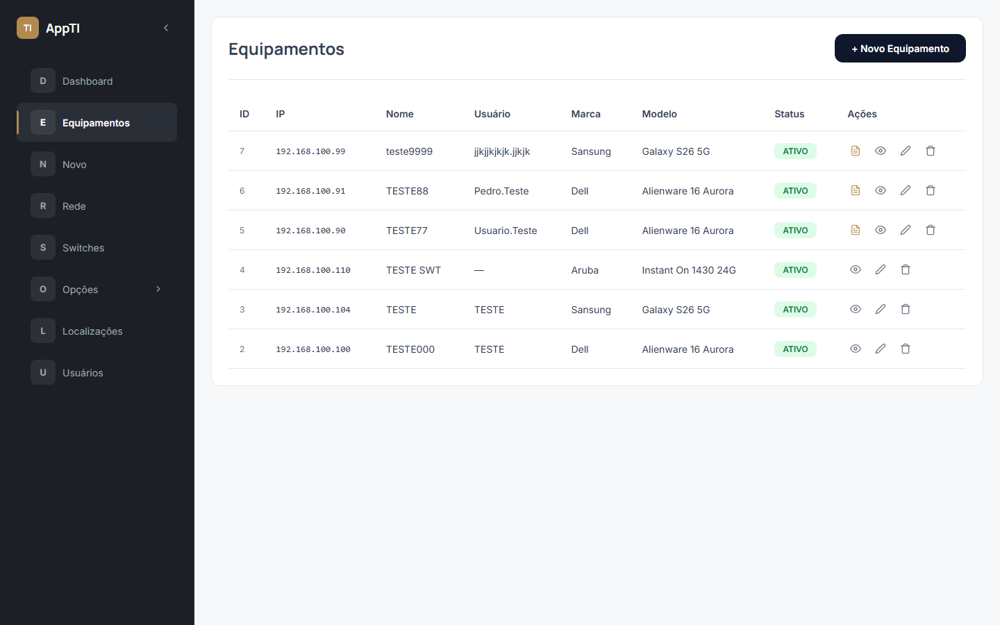
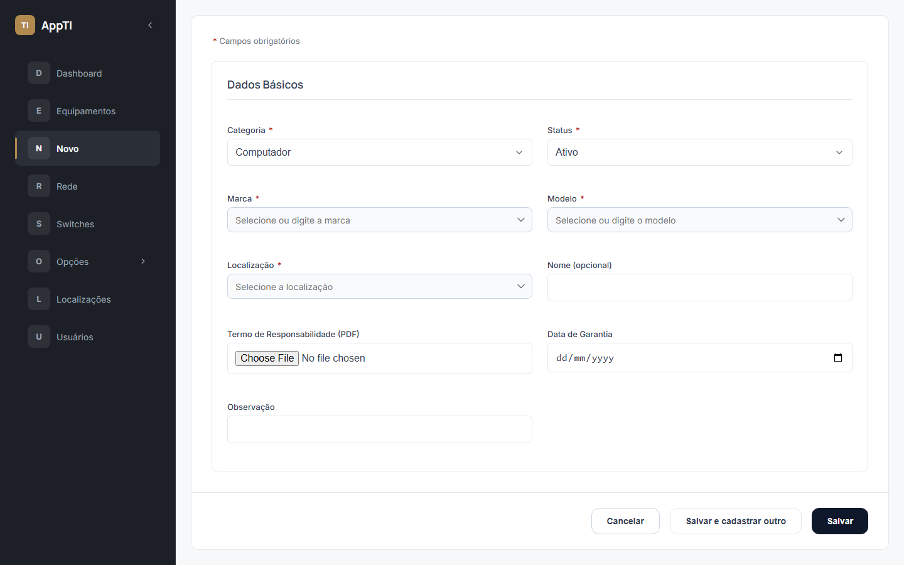
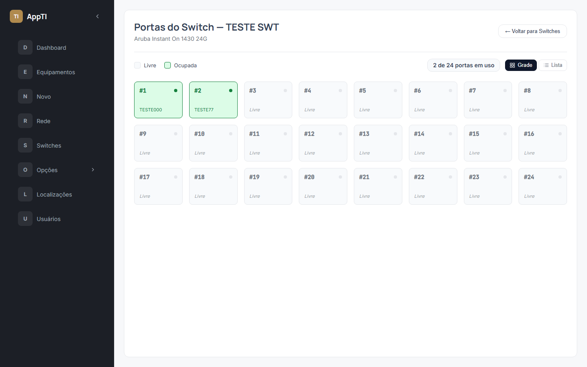
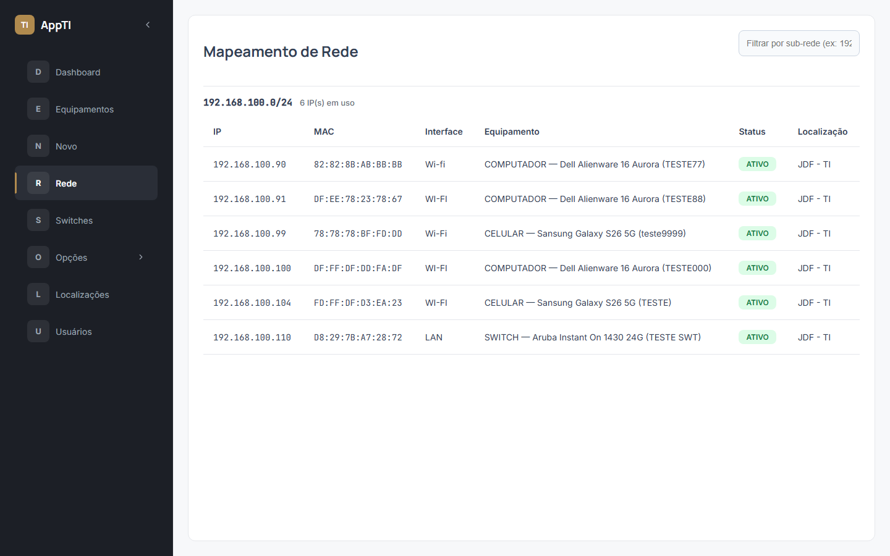

# Sistema de Gestão de Inventário de TI

Sistema web para controle e gestão centralizada de ativos e infraestrutura de TI (notebooks, desktops, switches, celulares, NVRs e câmeras de CFTV), incluindo mapeamento de rede e gerenciamento de portas de switches.

---

## 🎯 Escopo e Contexto do Projeto

### 1. Para quem este projeto foi pensado
O sistema foi desenvolvido para atender **pequenas equipes de TI** (na faixa de 1 a 10 usuários operando o sistema), gerenciando o inventário de uma **única organização**.
- **Instância Única (sem Multi-tenant):** Não há isolamento de dados entre empresas distintas em uma mesma execução. Cada instalação serve exclusivamente a uma organização.

### 2. Limitações técnicas deliberadas
- **Banco de dados SQLite:** Escolhido pela excelente simplicidade de deploy e manutenção (banco em arquivo único, dispensando servidores de banco de dados separados) e pela adequação ao volume de dados de pequenas equipes. Não é voltado para altíssima concorrência de escrita ou volumes massivos de dados. Caso o volume cresça, o próximo passo natural é a migração para **PostgreSQL** — inclusive, o schema relacional (`schema.sql`) utiliza SQL padrão de forma simples e direta, facilitando essa migração se necessário.
- **Idioma único (`pt-BR`):** A interface e mensagens do sistema estão disponíveis apenas em Português do Brasil (sem camada de internacionalização/i18n).
- **Autenticação própria por e-mail e senha:** Login baseado em e-mail/senha com hashes `bcrypt` e tokens `JWT`, sem suporte nativo a SSO, OAuth2 ou provedores de identidade externos (como Active Directory/SAML).

### 3. O que o sistema deliberadamente NÃO faz (Fora de Escopo)
Com base no planejamento inicial, as seguintes funcionalidades ficaram **fora de escopo por decisão de projeto**:
- **Gestão de licenças de software:** Não faz controle de licenças ou chaves de software.
- **Abertura de chamados e Help Desk:** Projetado para ser utilizado em conjunto com ferramentas dedicadas de Help Desk (como o GLPI), e não para substituí-las.
- **Histórico e trilha de auditoria completa:** Não registra logs de cada alteração individual realizada nos ativos ao longo do tempo.
- **Processos formais de descarte e compliance LGPD:** Não inclui fluxos formais de aprovação de descarte ou ciclo de vida de privacidade.

*Estas decisões visam manter o sistema leve e focado. Como o projeto é código aberto sob licença MIT, qualquer equipe pode adaptar o código fonte para incluir essas capacidades conforme suas necessidades.*

> Se o seu caso de uso tem necessidades diferentes dessas (multi-tenant, alta escala, i18n ou integração SSO), este projeto pode servir de ponto de partida, mas vai precisar de adaptações antes de ser usado nesse cenário.

---

## 📸 Screenshots











> 💡 **Como regenerar os screenshots:**
> 1. Certifique-se de que o **back-end** (porta 3000) e o **front-end** (porta 5173) estejam em execução.
> 2. *(Opcional)* Defina as variáveis de ambiente `SCREENSHOT_EMAIL` e `SCREENSHOT_SENHA` caso utilize credenciais diferentes de `admin@admin.com` / `admin123`.
> 3. No diretório `front-end/`, execute o comando:
>    ```bash
>    npm run screenshots
>    ```
>    O script via **Playwright** emulando o viewport de notebook (1440x900) atualizará automaticamente as capturas em `docs/screenshots/`.

---

## 🛠️ Stack Tecnológica

### Back-end
- **Runtime & Linguagem:** Node.js (ESM), TypeScript
- **Framework Web:** Express (v5)
- **Banco de Dados:** SQLite (via `better-sqlite3`) com suporte a WAL e Foreign Keys
- **Validação & Segurança:** Zod, Helmet, CORS, Express Rate Limit, Bcrypt, JSON Web Token (JWT)
- **Uploads & Tarefas:** Multer, Node-Cron
- **Testes:** Vitest, Supertest

### Front-end
- **Biblioteca & Build:** React (v19), Vite, TypeScript
- **Roteamento:** React Router DOM (v6)
- **Estilização:** Vanilla CSS com CSS Modules e Design Tokens globais em `:root`

---

## 📁 Estrutura do Projeto

- **[`back-end/`](./back-end/README.md):** API RESTful Express, banco de dados SQLite, controle de migrações e suíte de testes.
- **[`front-end/`](./front-end/README.md):** Single Page Application (SPA) desenvolvida em React.

---

## 📋 Pré-requisitos

- **Node.js:** Versão `v18.x` ou superior (recomenda-se a versão LTS mais recente).
- **Gerenciador de Pacotes:** `npm` (geralmente instalado com o Node.js).

---

## 🚀 Primeira Vez Rodando o Projeto

### 1. Configurar e rodar o Back-end

Navegue até a pasta `back-end`:
```bash
cd back-end
npm install
cp .env.example .env
npm run setup
npx tsx src/scripts/criarAdmin.ts
npm run dev
```
O servidor back-end iniciará em `http://localhost:3000`.

*Para mais detalhes sobre variáveis de ambiente, migrations e comandos do back-end, acesse o [README do Back-end](./back-end/README.md).*

### 2. Configurar e rodar o Front-end

Em outro terminal, navegue até a pasta `front-end`:
```bash
cd front-end
npm install
npm run dev
```
A aplicação web estará disponível no navegador em `http://localhost:5173`.

*Para mais detalhes sobre consumo da API, estrutura de componentes e design system, acesse o [README do Front-end](./front-end/README.md).*

---

## ⚠️ Segurança — antes de usar em produção

### 1. Credenciais Padrão do Administrador
Ao executar o script `npx tsx src/scripts/criarAdmin.ts` sem que as variáveis de ambiente `ADMIN_EMAIL` e `ADMIN_SENHA` estejam definidas no arquivo `.env`, o script utiliza credenciais padrão previsíveis (`admin@admin.com` / `admin123`) e exibe um aviso no console.

> 🚨 **Atenção:** O uso do fallback padrão destina-se exclusivamente para facilitar o desenvolvimento local. Executar esse script em ambiente de produção sem definir essas variáveis cria uma vulnerabilidade grave de segurança, pois qualquer pessoa com conhecimento do projeto saberá as credenciais de acesso.

**Recomendação:** Defina sempre `ADMIN_EMAIL` e `ADMIN_SENHA` (com senha de no mínimo 8 caracteres, validada pelo script) no arquivo `.env` antes de executar `npx tsx src/scripts/criarAdmin.ts` em qualquer ambiente que não seja sua máquina local de desenvolvimento.

### 2. Troca de Senha no Primeiro Acesso
Mesmo definindo uma senha customizada no arquivo `.env` durante a inicialização, recomenda-se que, após o primeiro login, a senha do administrador seja alterada através da própria interface da aplicação como boa prática adicional.
- **Caminho na interface:** Acesse a tela de **Usuários** (`/admin/usuarios` no menu lateral) e utilize o botão de redefinir senha do usuário desejado.

### 3. Configuração Obrigatória da `JWT_SECRET`
A variável de ambiente `JWT_SECRET` é obrigatória para a segurança dos tokens de autenticação. Conforme implementado no middleware de autenticação (`authMiddleware.ts`) e no serviço de autenticação (`authService.ts`), a aplicação lançará um erro e recusará a inicialização caso a `JWT_SECRET` não esteja definida.

Em ambiente de produção, gere um segredo forte e aleatório executando o comando no terminal:
```bash
node -e "console.log(require('crypto').randomBytes(32).toString('hex'))"
```

### 4. Checklist Rápido Antes de Colocar em Produção
- [ ] **`JWT_SECRET`**: Variável configurada no `.env` com um valor forte e aleatório gerado via Node.js / Crypto.
- [ ] **`FRONTEND_URL`**: Ajustada no `.env` para corresponder ao domínio real de produção (ex: `https://meusistema.com`), e não `http://localhost:5173`.
- [ ] **`ADMIN_EMAIL` e `ADMIN_SENHA`**: Definidas no `.env` com valores seguros (mínimo de 8 caracteres) antes da execução de `npx tsx src/scripts/criarAdmin.ts`.
- [ ] **Troca de Senha Pós-Login**: Senha do administrador alterada via interface gráfica em **Usuários** (`/admin/usuarios`).
- [ ] **`PORT`**: Porta de execução ajustada para o ambiente do servidor HTTP.
- [ ] **Arquivo `.env`**: Protegido e não incluído no repositório de controle de versão.

---

## Licença

Este projeto está licenciado sob a licença MIT — veja o arquivo LICENSE para mais detalhes.


